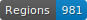

[![CC BY-NC-SA 4.0][cc-by-nc-sa-shield]][cc-by-nc-sa][](https://doi.org/10.5281/zenodo.7075075)

    

# HTR - Araucania manuscript XIXe

Ground Truth dataset for Spanish 19th typewritten OCR. 

The archives come from the events of the Occupation of Araucania (1850-1881) in Chile. They are archived in the 'Colección manuscritos' of the Archivo Central Andres Bello - Universidad de Chile.

Thereby, it is not possible to publicly distribute the images (.jpg)

To use them for segmentation/recognition model training, please contact me : archivo.central@uchile.cl


## Dataset

| **Name**                   | **Pages** | **Extreme dates** | **Description**                                                          | **Test Data** |
|:--------------------------:|:---------:|:-----------------:|:------------------------------------------------------------------------:|:-------------:|
| **Cornelio Saavedra**      | 43        | 11/1859 – 08/1877 | clean style, good condition, presence of postscript notes                | N             |
| **Avello, Juan**           | 12        | 11/1859 – 11/1860 | clean style, some sheets damaged, presence of post-scriptum notes        | N             |
| **Diaz, José Del Carmen**  | 21        | 12/1859 – 03/1860 | clean style sometimes condensed, good condition                          | N             |
| **Escala, Manuel Segundo** | 13        | 11/1859 – 11/1860 | very clean style, good condition                                         | N             |
| **Garcia Videla, Daniel**  | 8         | 05/1860 – 06/1860 | very clean style, good condition                                         | N             |
| **Pérez Rosales, Vicente** | 12        | 02/1860 – 11/1860 | sometimes hesitant and condensed style, good condition                   | N             |
| **Sepulveda, José**        | 8         | 12/1859 – 11/1860 | intermediate style, some damaged leaves, presence of post-scriptum notes | Y             |
| **Villalon, Vicente**      | 22        | 11/1859 – 11/1859 | clean style, sometimes erased, presence of post-scriptum notes           | N             |
| **Contreras, Juan**        | 16        | 03/1860 – 06/1860 | decent style, some leaves slightly damaged                               | N             |
| **random data**        | 23        | 11/1859 – 11/1859 | 16 hands, good condition                              | N             |


## Methodology

Transcription rules :

- `xxx` for blurred or unreadable characters
- `^+letters` for superscript letters
- `⁋` for new paragraph

Using the Kraken OCR engine in finetuning with the Menu_MacFrench template. A template uses the NFKD method.

## Evaluation

| **Name**                   | **Quantity (GT)** | **Val_acc** | **Test_acc** | **CER** | **WER** |
|:--------------------------:|:-----------------:|:-----------:|:------------:|:-------:|:-------:|
| **HTR-Araucania_XIX**      | 180               | 0,90354     | 0,8673       | 0,05598 | 0,21423 |
| **HTR-Araucania_XIX_NFKD** | 180               | 0,89872     | 0,8563       | 0,06646 | 0.24963 |


## Others

JSONL file for NER annotation in `ner/`
(MISC, LOC, PERS, ORG, DATE)

## How to cite

```
name: 'AraucaniaCorpus'
url: 'https://github.com/Proyecto-Ocupacion-Araucania-UChile/HTR_Araucania_XIX'
author: {'Maxime Humeau', 'Alessandro Chiaretti'}
month: 'september'
year: '2022'
version: '{any version}'
description: 'Ground Truth dataset for Spanish 19th typewritten OCR'
language: 'Spanish'
time: '1859-1877'
hands: ''
license:
    - {name: 'CC BY-NC-SA 4.0', url: 'https://creativecommons.org/licenses/by-nc-sa/4.0/'}
format: 'ALTO'
volume:
    - {count: "180", metric: pages}
```
This work is licensed under a
[Creative Commons Attribution-NonCommercial-ShareAlike 4.0 International License][cc-by-nc-sa].

[![CC BY-NC-SA 4.0][cc-by-nc-sa-image]][cc-by-nc-sa]

[cc-by-nc-sa]: http://creativecommons.org/licenses/by-nc-sa/4.0/
[cc-by-nc-sa-image]: https://licensebuttons.net/l/by-nc-sa/4.0/88x31.png
[cc-by-nc-sa-shield]: https://img.shields.io/badge/License-CC%20BY--NC--SA%204.0-lightgrey.svg
